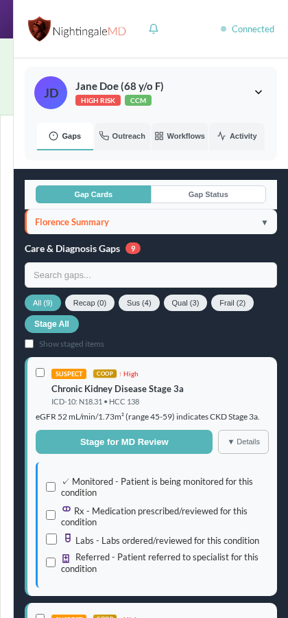
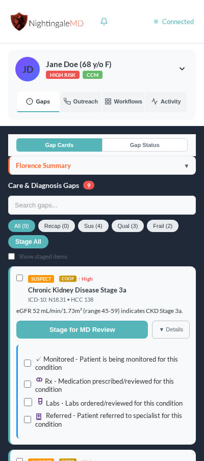
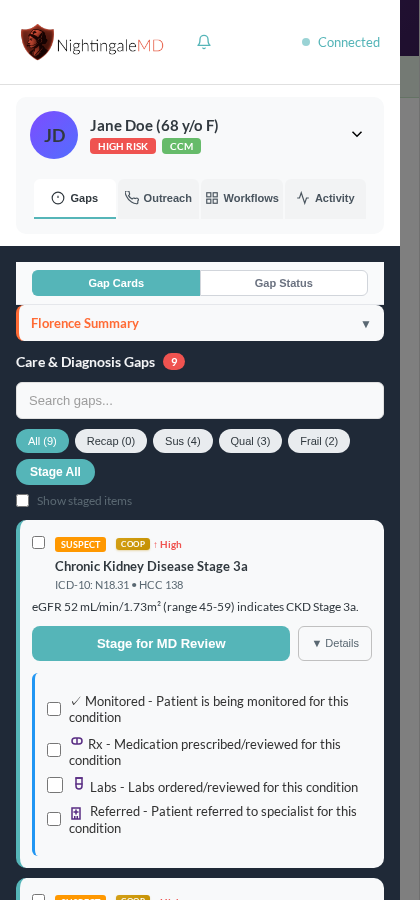
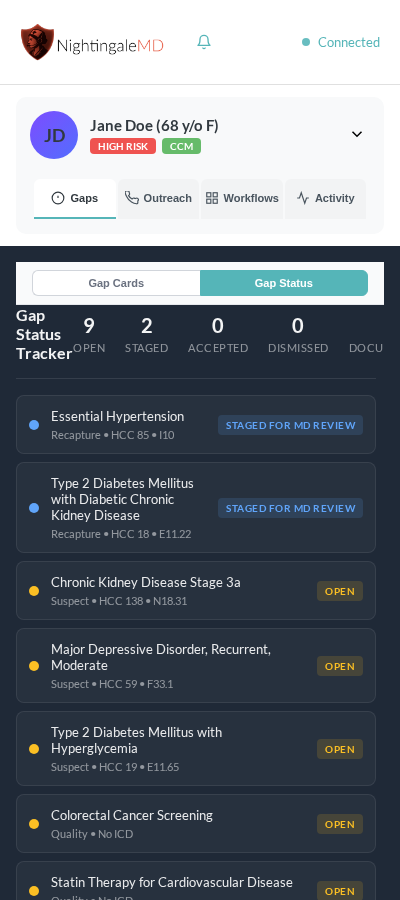
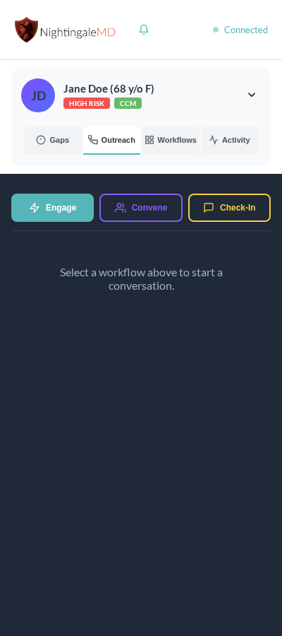
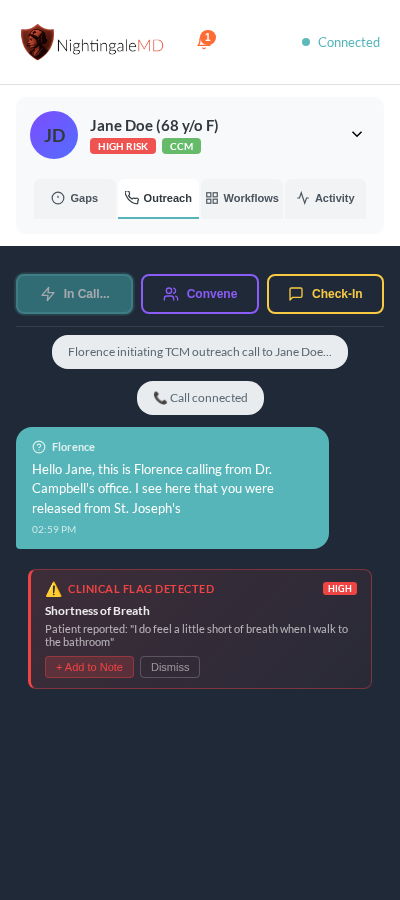
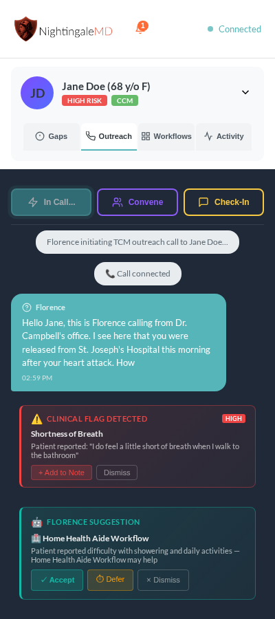
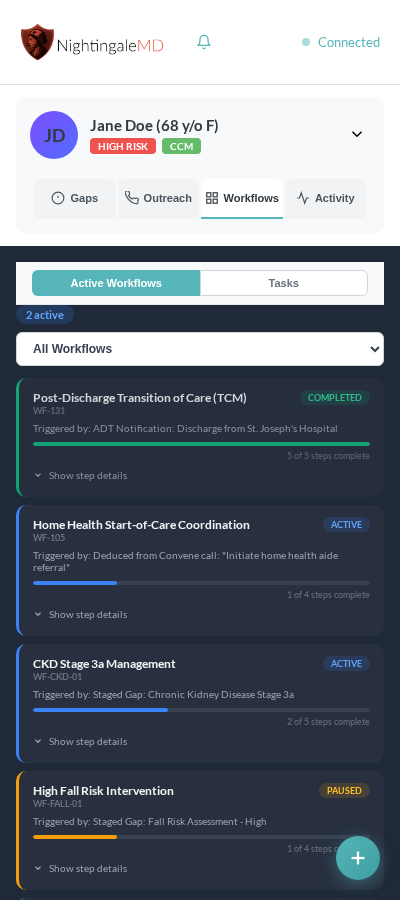
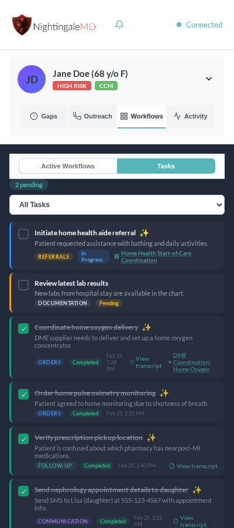
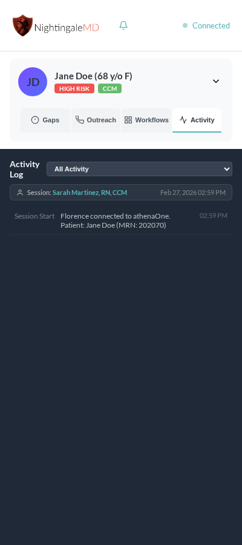

# Florence AI Navigator  
## Product Bible — Complete User Guide & Clinical Reference

**NightingaleMD** | Proprietary Information | For Customer Use  
Version 2.0 | February 2026

---

## Executive Summary

In today’s value-driven healthcare landscape, care managers play a vital role in delivering high-quality, coordinated patient care while meeting rigorous documentation, compliance, and billing requirements. Yet these demands often pull care managers away from what matters most: building trust and engaging deeply with patients.

Florence AI Navigator is a trusted clinical AI assistant that transforms care management by seamlessly blending intelligent automation with compassionate patient engagement. Designed specifically for care managers, Florence helps reduce administrative burden and mental workload, enabling clinicians to focus on their most important clinical skills.

Florence integrates with the care manager’s phone or video call system to capture and transcribe patient conversations in real time. This allows Florence to identify clinically relevant information and generate compliant documentation seamlessly during the interaction. By listening alongside the care manager, surfacing actionable insights, and preparing documentation as a natural byproduct of care, Florence ensures accuracy, compliance, and workflow efficiency.

Backed by rigorous research detailed in our foundational white paper, *The AI Nurse Extender: Redefining Care Management Through Intelligent Automation*, which analyzed time-motion studies and care manager workflows, Florence addresses the documented reality that care managers spend an estimated 40–60% of their time on documentation, coordination, and administrative tasks — time that should be devoted to direct patient engagement (Section 2.3, Documentation Burden Analysis). By reclaiming this time, Florence drives improved clinical outcomes, enhances patient satisfaction, and supports operational goals tied to Medicare Advantage, Chronic Care Management (CCM), Transitional Care Management (TCM), and other value-based care programs.

For health system executives and clinical leaders, Florence represents a strategic investment in workforce sustainability, care quality, and financial performance.

For detailed definitions of clinical and technical terms, please refer to Appendix A — Glossary. Appendix B provides a comprehensive catalog of care management workflows supported by Florence.

---

## Table of Contents

1. [The Problem Florence Solves](#1-the-problem-florence-solves)  
2. [The Florence Philosophy](#2-the-florence-philosophy)  
3. [The Interface — The Florence Panel](#3-the-interface--the-florence-panel)  
4. [The Gaps Tab — Clinical Intelligence at a Glance](#4-the-gaps-tab--clinical-intelligence-at-a-glance)  
5. [The Outreach Tab — Conducting Patient Calls](#5-the-outreach-tab--conducting-patient-calls)  
6. [The Intelligence Layer — Listening During the Call](#6-the-intelligence-layer--listening-during-the-call)  
7. [The Workflows Tab — Coordinating Care Actions](#7-the-workflows-tab--coordinating-care-actions)  
8. [The Activity Tab — The Audit Trail](#8-the-activity-tab--the-audit-trail)  
9. [Filing to the EHR — Closing the Loop](#9-filing-to-the-ehr--closing-the-loop)  
10. [The Patient — Jane Doe's Story](#10-the-patient--jane-does-story)  
11. [White Paper Alignment Reference](#11-white-paper-alignment-reference)  
12. [Appendix A — Glossary](#appendix-a--glossary)  
13. [Appendix B — Workflow Catalog](#appendix-b--workflow-catalog)  

---

## 1. The Problem Florence Solves

Care managers are essential frontline clinicians whose primary mission is to connect with patients — to listen attentively, build trust, and detect subtle clinical changes that can prevent costly complications. However, the reality of modern care management is that these clinicians are burdened by extensive documentation, coding, coordination, and compliance tasks that fragment their attention.

The consequence is a care manager who is only partially present during patient encounters: one eye on the patient, one eye on the keyboard; one ear listening for clinical cues, one ear listening for the next thing to document. This split focus not only slows workflows but also degrades the quality of patient care, contributing to clinician burnout and missed opportunities for early intervention.

As detailed in our foundational white paper, *The AI Nurse Extender: Redefining Care Management Through Intelligent Automation*, which analyzed time-motion studies and care manager workflows:

> *"Care managers spend an estimated 40–60% of their time on documentation, coordination, and administrative tasks — time that should be devoted to direct patient engagement."*  
> *(NightingaleMD White Paper, Section 2.3, Documentation Burden Analysis)*

Florence was built to reclaim this lost time — not by eliminating necessary documentation, which remains critical for compliance, billing, and continuity of care — but by transforming documentation from a competing task into a natural byproduct of clinical interaction.

When a care manager uses Florence, they can be fully present with the patient. Florence listens alongside them by integrating with the care manager’s phone or video call system to capture and transcribe patient conversations in real time. It captures clinically relevant information, surfaces actionable insights, and prepares documentation continuously during the interaction. By the end of the call, a comprehensive Care Manager’s Note is ready to review and file with a single click.

**Florence’s fundamental commitment is clear: to ensure care managers devote their full attention to patients, not to documentation tasks.**

---

## 2. The Florence Philosophy

### Attend First, Document Second

Florence is designed around a single guiding principle: **care managers should never have to choose between being fully present with their patients and meeting documentation requirements.**

This principle shapes every aspect of Florence’s design:

- **Florence listens during the call so the care manager doesn’t have to take notes.** This frees cognitive resources to focus on clinical judgment and patient rapport.
- **Florence surfaces clinical flags and prompts so the care manager doesn’t have to remember every detail.** This reduces mental workload and ensures no critical issues are overlooked.
- **Florence suggests specific care coordination workflows — such as arranging medication reconciliation, scheduling follow-up visits, or connecting patients to social support services — tailored to the conversation, so care managers don’t need to memorize complex intervention catalogs.** This accelerates appropriate interventions and referrals.
- **Florence prepares the clinical note in real time so the care manager doesn’t have to reconstruct the encounter afterward.** This streamlines documentation and reduces errors.

### The Care Manager Is Always in Control

Crucially, **none of these actions happen automatically or without the care manager’s explicit approval.** Florence follows a clear three-step approach: it first **surfaces** relevant clinical information, then **suggests** appropriate actions, and finally waits for the care manager to **confirm** before proceeding.

When Florence detects a clinical or social need — such as a patient reporting difficulty obtaining food — it does not act autonomously. Instead, it presents a suggestion card in the transcript:

> *"Patient reported difficulty getting food — Feed Assistance Workflow may help."*

The care manager reviews this suggestion in the context of the full conversation and decides whether to **Accept**, **Defer**, or **Dismiss** it. This human-in-the-loop model respects clinical judgment as irreplaceable while offloading the cognitive overhead that surrounds it.

This approach is especially important in value-based care environments where inappropriate interventions carry both clinical and financial consequences. Florence never starts a workflow, files a note, or takes any action without explicit care manager authorization.

### Documentation as a Byproduct of Care

Traditional care management workflows treat documentation as a separate, post-encounter task. Care managers finish the call, then open the note and reconstruct the conversation from memory — a process prone to error, delay, and burnout.

Florence inverts this workflow. Documentation happens invisibly and continuously during the clinical interaction. By the time the call ends, a comprehensive Care Manager’s Note is already drafted, capturing:

- Patient-reported symptoms and concerns  
- Actions taken during the call  
- Gaps identified and addressed  
- Planned next steps and follow-up  

The care manager reviews this note, makes any necessary adjustments, and files it to the EHR with one click.

### Privacy and Data Security

Florence AI Navigator is built with stringent privacy and security protocols, fully compliant with HIPAA and other relevant regulations, ensuring patient data is protected at every step. The integration with phone and video call systems is designed to safeguard confidentiality and maintain compliance with all applicable standards.

---

## 3. The Interface — The Florence Panel

Florence lives inside the EHR as a side panel, integrated directly into the athenaOne environment. It is always present, always connected, and never intrusive. The panel does not replace the EHR — it augments it by providing a seamless layer of clinical intelligence that supports care managers without disrupting their existing workflows.

*The Florence panel sits alongside the EHR, providing real-time clinical intelligence without disrupting the existing workflow.*

### The Header

At the top of every Florence session, the header displays:

| Element | Purpose |
|---|---|
| **NightingaleMD Logo** | Confirms Florence is active and authenticated, ensuring secure and compliant access to patient data |
| **Notification Bell** | Proactive alerts for pending items requiring your immediate attention, ensuring no critical task or patient need is overlooked |
| **Connection Status** | Green "Connected" indicator confirms live, secure EHR synchronization and data integrity |

The connection status is not merely decorative; it is a critical indicator. A green "Connected" confirms Florence has an active, authenticated, and secure session with your EHR. This guarantees that any documentation or action taken within Florence is immediately and accurately written back to the patient’s official record in real time, ensuring data integrity and compliance. If the connection drops, Florence will alert the care manager immediately, preventing any loss of work or documentation discrepancies.

### The Patient Banner

Directly below the header, the patient banner provides an immediate clinical snapshot of the patient being managed.

*The patient banner gives the care manager an immediate clinical snapshot before any interaction begins.*

| Element | What It Shows | Why It Matters |
|---|---|---|
| **Patient Avatar** | Initials and color-coded circle | Instant visual identification |
| **Name and Age** | Jane Doe (68 y/o F) | Confirms correct patient context |
| **HIGH RISK badge** | Risk stratification level | Signals the level of care intensity and proactive intervention required, enabling you to prioritize and allocate resources effectively for your most vulnerable patients |
| **CCM badge** | Program enrollment (CCM, TCM, AWV) | Confirms the patient’s enrollment in specific value-based care programs (e.g., Chronic Care Management, Transitional Care Management, Annual Wellness Visit). This is critical for ensuring every interaction is accurately attributed, documented, and billed to the correct program, optimizing reimbursement and demonstrating program efficacy |
| **Expand chevron** | Opens full clinical summary | Access to full patient context |

The risk stratification badge reflects patient risk levels derived from your organization’s established risk models or Florence’s configurable algorithms, ensuring alignment with your clinical criteria and priorities.

The program enrollment badge indicates the patient’s current enrollment status as recorded in the EHR, providing real-time visibility into care management program participation — paramount for ensuring compliant documentation, accurate billing, and demonstrating the value of care management services within specific value-based care models.

### The Four Tabs

Below the patient banner, four tabs organize every Florence capability:

| Tab | Purpose |
|---|---|
| **Gaps** | Clinical and quality gaps requiring action |
| **Outreach** | Patient call workflows (Engage, Convene, Check-In) |
| **Workflows** | Active care coordination workflows and tasks |
| **Activity** | Timestamped audit trail of all session actions |

Each tab is thoughtfully designed around a specific phase of your care management workflow. Together, they provide a comprehensive, intuitive pathway through the complete lifecycle of a patient interaction — from identifying critical needs, to executing interventions, coordinating follow-up, and meticulously documenting every step. This integrated approach empowers you to manage your caseload efficiently and effectively.

---

## 4. The Gaps Tab — Clinical Intelligence at a Glance

The Gaps tab is where Florence presents the care manager with a prioritized, actionable view of everything that requires clinical attention for this patient. It serves as your immediate starting point for every patient encounter — Florence’s answer to your fundamental question: *“What does this patient need from me today?”* This intelligent prioritization helps you cut through the noise and focus your valuable time where it matters most.

### Gap Cards — The Default View

*The Gap Cards view presents every clinical and quality gap in a prioritized, actionable format.*

When the Gaps tab opens, it defaults to the **Gap Cards** view — a scrollable list of every identified gap for the patient, organized by clinical priority. Each card contains:

- **Gap name and ICD-10 code** — the specific clinical condition or quality measure  
- **HCC category** — the Hierarchical Condition Category, crucial for accurate risk adjustment and demonstrating patient complexity for value-based care models  
- **Priority level** — High, Medium, or Low based on clinical urgency and program requirements  
- **Gap type** — Recapture (known diagnosis needing re-documentation), Suspect (probable diagnosis needing evaluation), or Quality (care measure needing completion)  
- **MEAT documentation** — Monitored, Evaluated, Assessed, Treated (MEAT) documentation status, indicating the level of clinical attention and supporting compliant risk adjustment  

This view exists because care managers need to see the full, holistic clinical picture *before* a patient interaction, not just rely on memory or fragmented data. Florence intelligently aggregates every open gap from the EHR, risk adjustment data, and quality measure registries into a single, prioritized, and actionable view, empowering you to be fully prepared and proactive.

#### The Filter Bar

Above the gap cards, a filter bar allows the care manager to focus on specific gap types:

| Filter | What It Shows |
|---|---|
| **All (9)** | Every open gap |
| **Recap (0)** | Recapture gaps — known diagnoses needing re-documentation |
| **Sus (4)** | Suspect gaps — probable diagnoses needing clinical evaluation |
| **Qual (3)** | Quality gaps — care measures not yet completed |
| **Frail (2)** | Frailty-related gaps requiring special attention |

The numbers in parentheses update in real time as gaps are staged or addressed.

#### Expanding a Gap Card

*Expanding a gap card reveals the full clinical evidence, MEAT documentation status, and staging options.*

Clicking on any gap card expands it to reveal:

- **Clinical evidence** — the specific data points (lab values, HCC codes, clinical notes) that support this gap  
- **MEAT documentation** — checkboxes for Monitored, Evaluated, Assessed, and Treated, allowing you to quickly and compliantly document the clinical basis and ongoing management of the gap, directly supporting accurate risk adjustment  
- **Stage for MD Review button** — your primary action for initiating physician review and closing the loop on identified gaps, ensuring timely clinical intervention  

#### The Florence Summary

At the top of the Gap Cards view, a collapsible **Florence Summary** provides a plain-language, AI-generated synthesis of the patient’s clinical picture. This is Florence’s intelligent interpretation of the complex data — a concise narrative that helps you quickly orient to the patient’s situation and immediate needs before a call, saving you precious time and mental effort.

The Florence Summary exists because raw gap lists are clinical data, not clinical context. A care manager preparing for a call with Jane Doe needs to know not just that she has 9 open gaps, but that she is a 68-year-old post-MI patient with suspected CKD, moderately severe depression, and a history of falls — and that the most urgent priorities today are her kidney function and medication reconciliation.

### Staging a Gap — The Stage Modal

When the care manager is ready to move a gap forward for physician review, they click **Stage for MD Review**. This opens the staging modal — one of the most important workflows in Florence.

*The staging modal presents the full MEAT documentation framework and clinical evidence for the physician.*

The staging modal presents:

1. **Gap name and ICD-10 code** — the specific condition being staged  
2. **Clinical evidence** — the supporting data (e.g., "eGFR 52 mL/min/1.73m² indicates CKD Stage 3a")  
3. **MEAT checkboxes** — the care manager confirms which MEAT criteria have been met:  
   - **Monitored** — the patient is being monitored for this condition  
   - **Rx** — medication has been prescribed or reviewed  
   - **Labs** — labs have been ordered or reviewed  
   - **Referred** — the patient has been referred to a specialist  

This modal exists because staging a gap for MD review is not a clerical act — it is a clinical handoff. The MEAT framework ensures that the physician receives not just a list of gaps, but a documented record of what the care team has already done for each condition. This is the foundation of compliant risk adjustment documentation.

> **White Paper Alignment:** The MEAT documentation framework directly supports the white paper’s discussion of *“structured clinical documentation that satisfies both care quality and risk adjustment requirements simultaneously”* (Section 4.1, Documentation Standards).

#### Bulk Staging

The **Stage All** button at the top of the gap list allows the care manager to stage multiple gaps simultaneously. A **Show staged items** checkbox toggles visibility of already-staged gaps, keeping the view focused on what still needs attention.

### Gap Status Tracker — The Population View

*The Gap Status Tracker provides a real-time dashboard of every gap’s current status across the full gap lifecycle.*

Switching to the **Gap Status** sub-tab reveals the Gap Status Tracker — a real-time dashboard showing every gap and its current position in the workflow:

| Status | Meaning |
|---|---|
| **OPEN** | Gap identified, no action taken yet |
| **STAGED FOR MD REVIEW** | Care manager has staged the gap; awaiting physician review |
| **ACCEPTED** | Physician has accepted the gap documentation |
| **DISMISSED** | Gap dismissed with documented rationale |
| **DOCUMENTED** | Gap fully documented and closed |

The tracker header shows aggregate counts: in Jane Doe’s case, 9 OPEN and 2 STAGED FOR MD REVIEW.

This view exists because care managers need to track not just what gaps exist, but where each gap is in the workflow. A gap that has been staged but not yet accepted by the physician is in a different state than one that is still open — and the care manager needs to know which is which, especially when preparing for a follow-up call or a pre-visit review.

---

## 5. The Outreach Tab — Conducting Patient Calls

The Outreach tab is where Florence becomes a true co-pilot. This is where the care manager conducts patient calls — and where Florence’s real-time intelligence layer activates.

*The Outreach tab presents the three call modalities, each designed for a specific clinical context.*

### The Three Call Modalities

Florence supports three distinct outreach workflows, each designed for a specific clinical context:

#### Engage — Transitional Care Management (TCM)

The **Engage** workflow is designed for post-discharge transitional care calls. It is used when a patient has just been released from a hospital or skilled nursing facility and needs immediate follow-up to prevent readmission.

The Engage call script guides Florence through:

- Medication reconciliation (confirming the patient has all discharge medications)  
- Weight monitoring education (the 2-pound/5-pound rule for heart failure patients)  
- Symptom screening (chest pain, shortness of breath, leg swelling)  
- Appointment scheduling (conferencing in the physician’s office for a follow-up appointment)  
- Red flag education (when to call 911)  

This workflow exists because TCM calls are time-sensitive, high-stakes interactions where the risk of readmission is highest. Florence ensures that every TCM call covers every required clinical element — not because the care manager would forget, but because the cognitive load of managing a complex post-discharge patient while simultaneously documenting the call is simply too high for any human to do perfectly every time.

> **White Paper Alignment:** The Engage workflow directly implements the white paper’s *“Transitional Care Management Protocol”* (Section 3.2), which identifies medication reconciliation, symptom screening, and follow-up scheduling as the three highest-impact interventions in the 72-hour post-discharge window.

#### Convene — Complex Care Management (CCM)

The **Convene** workflow is designed for complex care management calls — the monthly touchpoints with high-risk patients enrolled in CCM programs. These calls are longer, more comprehensive, and cover a broader range of clinical and social needs.

The Convene call script covers:

- Current symptom status and functional assessment  
- Medication adherence and side effect monitoring  
- Social determinants of health screening  
- Care coordination (specialist appointments, DME orders, home health)  
- Goal-setting and patient activation  

This workflow exists because CCM calls are where the most complex clinical and social needs surface. A patient who mentions difficulty showering, food insecurity, or caregiver burnout during a CCM call is signaling needs that require coordinated responses — and Florence is listening for every one of them.

#### Check-In — Brief Monitoring Calls

The **Check-In** workflow is designed for brief, focused monitoring calls — the 10-15 minute touchpoints between major care management encounters. These calls confirm medication adherence, check on recent lab results, and address any emerging concerns before they escalate.

### Starting a Call

When the care manager clicks any of the three workflow buttons, Florence:

1. Displays a status bar: *“Florence initiating TCM outreach call to Jane Doe...”*  
2. Shows a **Call connected** indicator when the call begins  
3. Activates the real-time transcript, showing every exchange between the care manager and the patient  
4. Begins listening for clinical flags and workflow triggers in the patient’s responses  

The call transcript is not just a record — it is a live, interactive workspace where Florence surfaces insights, flags concerns, and suggests actions in real time.

---

## 6. The Intelligence Layer — Listening During the Call

This is the heart of Florence. While the care manager is fully present with the patient — listening, building rapport, making clinical judgments — Florence is simultaneously processing every word the patient says, looking for signals that require attention.

Florence is not just recording the call. Florence is **listening for clues of anything it can do for the care manager.**

### Clinical Flag Detection

*When Florence detects a clinical keyword in the patient’s speech, it immediately surfaces a Clinical Flag card in the transcript.*

When a patient says something that triggers a clinical concern, Florence immediately surfaces a **Clinical Flag** card in the transcript. The card appears inline — right where the relevant patient statement was made — so the care manager can see the flag in context.

Each Clinical Flag card shows:

- **Flag type** (e.g., “Shortness of Breath”)  
- **Severity badge** (CRITICAL, HIGH, or MEDIUM)  
- **The exact patient quote** that triggered the flag  
- **Two action buttons**: **+ Add to Note** and **Dismiss**  

The **+ Add to Note** button inserts a *“⚠ Patient-Reported Concerns”* section into the care manager’s note, documenting the clinical concern with the patient’s own words. The **Dismiss** button removes the card and logs the dismissal to the Activity tab.

Florence detects the following clinical categories:

| Category | Severity | Example Trigger |
|---|---|---|
| Chest Pain | CRITICAL | “chest pain,” “chest pressure,” “heart hurts” |
| Shortness of Breath | HIGH | “short of breath,” “can’t breathe,” “breathing hard” |
| Dizziness / Fall Risk | HIGH | “dizzy,” “fell,” “losing balance” |
| Medication Running Out | HIGH | “running out of medication,” “can’t afford pills” |
| Mental Health Concern | CRITICAL | “feeling hopeless,” “don’t want to go on,” “depressed” |
| Edema / Swelling | MEDIUM | “legs are swollen,” “feet are puffy” |
| Infection / Fever | MEDIUM | “fever,” “infected,” “wound is red” |
| Cognitive Concern | MEDIUM | “forgetting things,” “confused,” “memory problems” |
| Nutrition / GI | MEDIUM | “not eating,” “nausea,” “stomach pain” |

This detection exists because care managers cannot simultaneously maintain full conversational presence with a patient and maintain a mental checklist of every clinical keyword to listen for. Florence handles the checklist so the care manager can handle the human connection.

### Workflow Suggestion Cards

*When Florence detects a social or care coordination need, it surfaces a Workflow Suggestion card with Accept, Defer, and Dismiss options.*

Beyond clinical flags, Florence also listens for signals that a specific **care coordination workflow** may be needed. When a patient mentions a need that maps to an available workflow — such as difficulty getting food, transportation challenges, or caregiver burnout — Florence surfaces a **Florence Suggestion** card.

The suggestion card shows:

- **The suggested workflow name** (e.g., “Home Health Aide Workflow”)  
- **The rationale** — the specific patient statement that triggered the suggestion  
- **Three action buttons**: **Accept**, **Defer**, **Dismiss**  

#### The Three Actions

| Action | What Happens | When to Use |
|---|---|---|
| **Accept** | Creates a new task linked to the workflow, starts the workflow in Active Workflows, logs to Activity | When the care manager agrees this is the right intervention now |
| **Defer** | Creates a `Pending Review` task in the Tasks list for post-call action | When the care manager wants to address it after the call |
| **Dismiss** | Removes the card, logs the dismissal | When the suggestion is not appropriate for this patient |

This workflow exists because care managers cannot be expected to memorize a catalog of 10+ available workflows and mentally match them to patient statements in real time. Florence does the matching — the care manager makes the decision.

> **White Paper Alignment:** This feature directly implements the white paper’s vision of *“AI-assisted care pathway identification”* (Section 5.3), where the system identifies appropriate care pathways from patient-reported needs without requiring the care manager to navigate complex decision trees.

Florence detects workflow triggers for the following needs:

| Patient Need | Suggested Workflow |
|---|---|
| Food / nutrition difficulty | Feed Assistance Workflow |
| Transportation barriers | Transportation Assistance Workflow |
| Depression / mental health | Mental Health Support Workflow |
| Fall risk / balance | Fall Prevention Workflow |
| Medication cost | Medication Assistance Workflow |
| Social isolation | Social Engagement Workflow |
| Housing / utilities | Social Determinants Workflow |
| Caregiver stress | Caregiver Support Workflow |

### The Inline Documentation Block

*When the call ends, Florence presents the completed Care Manager’s Note inline in the transcript for review and filing.*

When the call concludes, Florence presents the completed **Care Manager’s Note** directly in the transcript — a SOAP-format clinical note that captures everything that happened during the call:

- **S (Subjective):** Patient-reported symptoms, concerns, and statements  
- **O (Objective):** Clinical data, vital signs, and observable findings  
- **A (Assessment):** Clinical assessment and gap status  
- **P (Plan):** Actions taken, follow-up scheduled, next steps  

The note is ready to review immediately. The care manager can edit any section, then click **File to EHR** to write the note directly to the patient’s athenaOne record.

This is the moment where documentation transforms from a burden into a byproduct. The care manager spent the entire call focused on Jane Doe — and Florence spent the entire call building the note.

---

## 7. The Workflows Tab — Coordinating Care Actions

The Workflows tab is where care coordination happens after the call. It is organized into two sub-views: **Active Workflows** and **Tasks**.

### Active Workflows

*The Active Workflows view shows every care coordination workflow currently in progress for this patient.*

The Active Workflows view shows every workflow that has been started for this patient, including:

- **Workflow name** (e.g., “Home Health Start-of-Care Coordination”)  
- **Status** (Active, Pending, Completed)  
- **Progress** — a visual indicator of how far through the workflow the patient is  
- **Steps** — the specific clinical actions that make up the workflow  
- **Triggered by** — the task or call that initiated this workflow  

Each workflow in the catalog is a structured sequence of clinical actions designed to address a specific patient need. The workflow catalog includes:

| Workflow | Purpose |
|---|---|
| Home Health Start-of-Care Coordination | Coordinate home health agency assignment and start-of-care visit |
| DME Coordination: Home Oxygen | Order and coordinate home oxygen delivery |
| Medication Assistance | Connect patient with prescription assistance programs |
| Transportation Assistance | Arrange non-emergency medical transportation |
| Mental Health Referral | Coordinate behavioral health evaluation and treatment |
| Social Determinants Intervention | Address food, housing, and utility needs |
| Fall Prevention Program | Enroll patient in fall prevention and home safety assessment |
| Caregiver Support | Connect caregiver with respite and support resources |
| Feed Assistance | Connect patient with meal delivery and nutrition programs |
| Social Engagement | Address isolation through community programs |

This catalog exists because care managers should not have to build care coordination workflows from scratch for every patient need. Florence provides a library of evidence-based workflows that can be initiated with a single click — and that automatically track progress, log actions, and surface the next steps.

### Tasks

*The Tasks list shows every action item for this patient, organized by status and linked to their parent workflows.*

The Tasks list shows every individual action item for this patient. Tasks are the atomic units of care coordination — the specific things that need to happen to move a workflow forward.

#### Task Statuses

| Status | Meaning | Visual |
|---|---|---|
| **Pending Review** | Awaiting care manager accept/deny — surfaced from a call | Amber left border, “PENDING REVIEW” badge |
| **In Progress** | Accepted and actively being worked | Blue left border, “In Progress” badge |
| **Pending** | Queued but not yet started | Yellow left border, “Pending” badge |
| **Completed** | Done, with timestamp | Green checkmark, strikethrough text |

#### Pending Review Tasks

Tasks with **Pending Review** status appear at the top of the list and represent items that Florence surfaced during a call and the care manager deferred for post-call action. These are the items that require the care manager’s explicit decision before any action is taken.

This status exists because not every suggestion Florence makes during a call can be acted on immediately. A care manager who is in the middle of a complex conversation with a patient cannot stop to evaluate a workflow suggestion in depth. Deferring creates a structured queue of pending decisions that the care manager can work through after the call.

#### Workflow Linkage

When a task is linked to a parent workflow, the task card shows the workflow name as a clickable link. This allows the care manager to navigate directly from a task to the workflow it belongs to, maintaining full context for every action.

#### The Workflows ↔ Tasks Connection

During a Convene call, Florence automatically deduces tasks from the conversation — specific actions that need to happen based on what the patient reported. When a task is deduced:

1. The Workflows tab briefly switches to the Tasks sub-view to show the new task being added  
2. The task highlights with a teal glow animation  
3. The care manager can see the task in context before returning to the call  

This connection exists because care coordination is not a linear process. A single patient call can generate multiple tasks across multiple workflows — and the care manager needs to see these tasks being created in real time, not discover them after the call ends.

---

## 8. The Activity Tab — The Audit Trail

The Activity tab is the complete, timestamped record of everything that happened during this Florence session. It is the answer to the question: *“What did we do for this patient today, and who did it?”*

*The Activity Log provides a complete, timestamped audit trail of every action taken during the session.*

### Session Header

Every Activity log opens with a session header that identifies:

- **Care Manager name and credentials** (e.g., “Sarah Martinez, RN, CCM”)  
- **Session date and time** (e.g., “Feb 27, 2026 02:59 PM”)  

This header exists because every action in the Activity log needs to be attributed to a specific clinician. In a care management environment where multiple team members may interact with a patient, the session header establishes clear accountability for every action taken.

### Log Entries

Each log entry shows:

- **Action type** (e.g., “Engage Call Completed,” “Clinical Flag,” “Gap Staged”)  
- **Description** — what happened  
- **Care manager attribution** — “by Sarah Martinez, RN, CCM” for care manager-initiated actions  
- **Timestamp** — precise time of the action  

### Activity Filter

The dropdown at the top of the Activity log allows filtering by activity type:

| Filter | Shows |
|---|---|
| **All Activity** | Every action in the session |
| **Outreach** | Call-related actions only |
| **Gaps** | Gap staging and documentation actions |
| **Workflows** | Workflow and task actions |
| **Clinical** | Clinical flag detections and responses |

This filter exists because the Activity log can become dense during a complex session. A care manager reviewing the log after a call needs to be able to quickly find specific types of actions without scrolling through everything.

### Why the Activity Log Matters

The Activity log is not just a convenience feature — it is a compliance requirement. In CCM, TCM, and other value-based programs, every billable interaction must be documented with:

- The identity of the clinician who performed the service  
- The date and time of the service  
- The specific clinical actions taken  

Florence’s Activity log provides all of this automatically, as a byproduct of normal care management workflow. The care manager does not need to separately document that they staged a gap, initiated a workflow, or detected a clinical flag — Florence records all of it in real time.

> **White Paper Alignment:** The Activity log directly supports the white paper’s discussion of *“automated compliance documentation”* (Section 6.2), which identifies real-time audit trails as a critical component of sustainable CCM program management.

---

## 9. Filing to the EHR — Closing the Loop

By the end of the call, Florence drafts a comprehensive Care Manager’s Note that the care manager can review and submit directly into the EHR with a single click, ensuring documentation is accurate, compliant, and immediately available for billing and clinical continuity.

When the care manager is satisfied with the Care Manager’s Note, they click **File to EHR**. This single action:

1. Writes the note directly to the patient’s athenaOne record  
2. Attributes the note to the care manager (e.g., Sarah Martinez, RN, CCM)  
3. Timestamps the filing  
4. Logs the action to the Activity tab  
5. Displays a confirmation: *“Care Manager’s Note Filed to EHR”*  

This is the moment where Florence’s work becomes permanent clinical record. The note is not a separate document that needs to be copy-pasted into the EHR — it is written directly to the patient record in the correct clinical format, in the correct section, with the correct attribution.

This capability exists because the final step of every care management encounter — getting the documentation into the EHR — is often the most time-consuming and error-prone part of the workflow. Care managers who finish a call and then have to manually open the EHR, navigate to the correct note section, and type out the encounter from memory are doing work that Florence can do for them.

**One click. The note is filed. The encounter is documented. The loop is closed.**

---

## 10. The Patient — Jane Doe's Story

Every feature in Florence is illustrated through the story of Jane Doe — a composite patient whose clinical complexity represents the real patients that care managers work with every day.

**Jane Doe, 68 y/o Female**  
- **Risk Level:** HIGH RISK  
- **Programs:** CCM, TCM  
- **Primary Diagnoses:** Essential Hypertension, Type 2 Diabetes Mellitus, Chronic Kidney Disease Stage 3a (suspected), Major Depressive Disorder  
- **Recent Event:** Discharged from St. Joseph’s Hospital following an acute MI  
- **Open Gaps:** 9 (2 Staged for MD Review, 7 Open)  
- **Active Workflows:** Home Health Start-of-Care Coordination, DME Coordination: Home Oxygen  

Jane’s story is not hypothetical — it is the clinical reality that care