# Florence AI Navigator: Comprehensive Sales Manual

**Version 2.0 — With Visual Walkthrough**
**NightingaleMD | February 2026**

---

## Table of Contents

- **Part 1: Strategic Context & Value Proposition**
  - Chapter 1: Introduction
  - Chapter 2: The Traditional CCA Process (Before Florence)
  - Chapter 3: The CCA Lifecycle with Florence
- **Part 2: The Pre-Encounter Workflow & Demo Scripts**
  - Chapter 4: The Navigator's View — Automating Pre-Encounter Tasks
  - Chapter 5: The 'Engage' Workflow — AI-Powered Patient Outreach
- **Part 3: The Encounter Workflow & Provider Perspective**
  - Chapter 6: The Provider's View — A Seamless Encounter
  - Chapter 7: Provider Best Practices
- **Part 4: Post-Encounter & Ongoing Management**
  - Chapter 8: The 'Convene' Workflow — Facilitating Care Team Collaboration
  - Chapter 9: The 'Check-In' Workflow — Proactive Patient Monitoring
  - Chapter 10: Filing to the EHR — Closing the Loop
  - Chapter 11: Conclusion — The Future of CCA

---

## Part 1: Strategic Context & Value Proposition

### Chapter 1: Introduction

**Audience:** This manual is designed for **sales representatives** at NightingaleMD. It provides the strategic context, workflow knowledge, and demo scripts needed to effectively showcase the Florence AI Navigator to prospective clients, including clinical stakeholders (CMOs, quality directors) and practice managers.

**Purpose:** The primary purpose of this manual is to serve as a comprehensive guide for conducting **live client demos**. It will equip you with the knowledge to not only demonstrate the features of Florence but also to articulate its profound value proposition within the complex ecosystem of Comprehensive Care Assessment (CCA).

**Key Value Propositions:** By automating and enhancing the CCA lifecycle, Florence delivers a powerful return on investment:

| Metric | Impact | Description |
|---|---|---|
| **Navigator Workload Reduction** | **70%** | Automates manual tasks like chart review, patient outreach, and documentation preparation, freeing up navigators to focus on high-value patient interactions. |
| **Gap Closure Rate Improvement** | **40%** | Proactively identifies and stages all care gaps from COOP, ensuring providers have the information they need at the point of care to close gaps effectively. |
| **Automated Documentation** | **100%** | Generates compliant, MEAT-criteria documentation in real-time as providers accept gaps, eliminating the documentation burden. |
| **Enhanced Patient Engagement** | **Yes** | Utilizes AI-powered voice and SMS to conduct TCM outreach, schedule appointments, and monitor patients, improving patient satisfaction and adherence. |

---

### Chapter 2: The Traditional CCA Process (Before Florence)

The traditional Comprehensive Care Assessment (CCA) process is a manual, time-consuming, and often inefficient workflow that places a heavy burden on care navigators and providers. Understanding these pain points is critical to articulating the value of Florence.

**The Manual CCA Workflow:**

1. **Manual Data Review:** The process begins when a care navigator manually reviews data from the Care Opportunities and Outcomes Platform (COOP) to identify patients who are due for a CCA (e.g., recently discharged, due for an AWV).
2. **Manual Chart Review:** The navigator then manually reviews the patient's chart in the EHR to identify all potential care gaps, including suspect diagnoses, quality measures, and frailty indicators.
3. **Manual Patient Outreach:** The navigator manually calls the patient to schedule a Transitional Care Management (TCM) call and a follow-up appointment.
4. **Manual Documentation Preparation:** Before the appointment, the navigator manually prepares all necessary documentation, including a summary of care gaps and supporting evidence.
5. **Provider Encounter:** During the visit, the provider must manually review the patient's chart and the navigator's notes to address care gaps, often without real-time decision support.
6. **Manual Follow-up:** After the visit, the navigator manually coordinates any necessary follow-up, such as specialist referrals or patient education.

**Key Pain Points of the Manual Process:**

| Pain Point | Description |
|---|---|
| **Time-Consuming** | The manual process can take **4-6 hours of navigator time per patient**, limiting the number of patients a single navigator can manage. |
| **Inconsistent Gap Identification** | Manual chart review is prone to human error, leading to missed care gaps and lost revenue opportunities. |
| **Provider Documentation Burden** | Providers spend a significant amount of time on documentation, taking away from patient care. |
| **Missed Follow-up Opportunities** | Manual follow-up is often inconsistent, leading to poor care coordination and patient outcomes. |
| **Limited Scalability** | The manual process is not scalable, making it difficult for practices to manage a growing patient population. |

---

### Chapter 3: The CCA Lifecycle with Florence

Florence transforms the CCA process by automating and enhancing each phase of the lifecycle, from trigger to ongoing management. This integrated approach ensures a seamless, efficient, and effective workflow.

**The 5 Phases of the CCA Lifecycle with Florence:**

1. **Trigger:** Florence automatically detects CCA triggers from COOP in real-time, including hospital discharge notifications, Annual Wellness Visit (AWV) due dates, new quality measure gaps, and suspect diagnosis gaps.

2. **Pre-Encounter:** Once a trigger is detected, Florence initiates the pre-encounter workflow — compiling all necessary CCA components from COOP and the EHR, automatically scheduling and conducting the TCM outreach call using the **Engage** workflow, confirming the follow-up appointment with the patient, and staging all identified care gaps for provider review.

3. **Encounter:** During the patient visit, Florence acts as a real-time copilot for the provider — displaying all staged gaps with supporting evidence in a convenient sidebar within athenaOne, allowing the provider to accept, reject, or defer each gap with a single click, and auto-generating MEAT-criteria documentation in real-time as gaps are accepted.

4. **Post-Encounter:** After the visit, Florence automates the post-encounter workflow — coordinating specialist referrals and follow-up appointments, sending automated patient education materials, and using the **Convene** workflow to facilitate care team meetings.

5. **Ongoing Chronic Condition Management:** Florence provides ongoing support for patients with chronic conditions — using the **Check-In** workflow to conduct routine monitoring via SMS, tracking medication adherence and care plan progress, and escalating to a human navigator when necessary.

---

## Part 2: The Pre-Encounter Workflow & Demo Scripts

### Chapter 4: The Navigator's View — Automating Pre-Encounter Tasks

This chapter details the pre-encounter workflow from the care navigator's perspective. The goal is to demonstrate how Florence automates the most time-consuming manual tasks, allowing navigators to operate at the top of their license.

**Demo Scenario:**
- **Patient:** Jane Doe, 68 y/o female, recently discharged from St. Joseph's Hospital after an acute MI.
- **Trigger:** Florence receives a real-time discharge notification from COOP.
- **Objective:** Demonstrate how Florence automates the TCM call, schedules the follow-up appointment, and stages all relevant care gaps for provider review.

---

#### Step 1: Open the Florence Dashboard

When you first open the Florence AI Navigator, you see the side-by-side view: the athenaOne EHR on the left and the Florence Copilot sidebar on the right. The patient's chart is already loaded with all relevant clinical data.

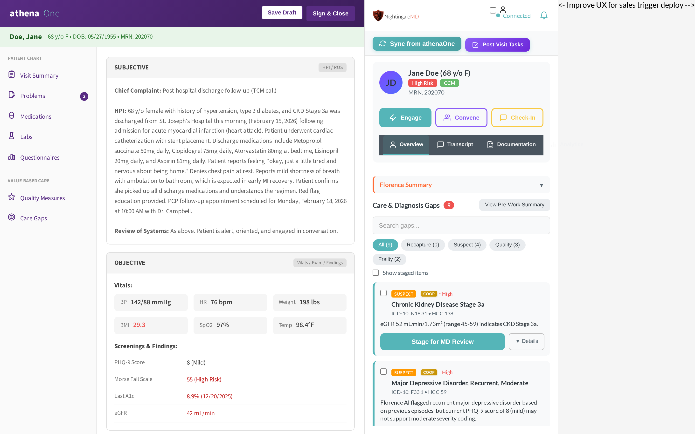
*Figure 1: The Florence AI Navigator integrated into athenaOne. The left panel shows the patient's EHR chart, while the right panel displays the Florence Copilot with patient summary, workflow buttons, and care gaps.*

---

#### Step 2: Review the Patient Summary

The Florence Copilot sidebar immediately shows the patient's key information at a glance. Jane Doe is flagged as **High Risk** and enrolled in **CCM** (Chronic Care Management). The three workflow buttons — **Engage**, **Convene**, and **Check-In** — are prominently displayed, along with tabs for Overview, Transcript, and Documentation.

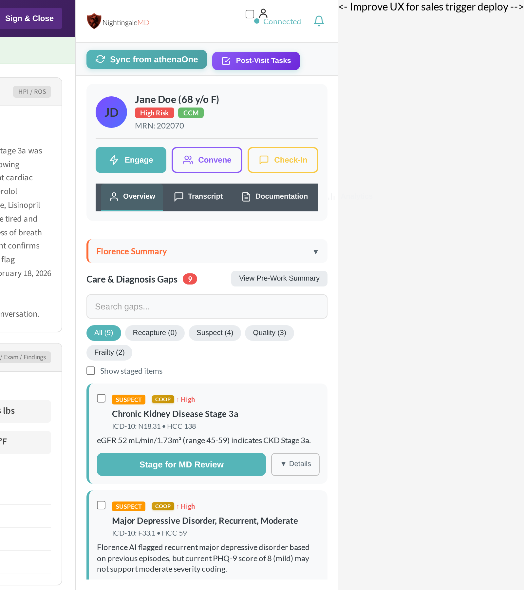
*Figure 2: The Florence Copilot sidebar showing patient summary (Jane Doe, 68 y/o F, High Risk, CCM), workflow action buttons, and the Overview tab with Florence Summary.*

---

#### Step 3: Review Care & Diagnosis Gaps

Scrolling down in the Copilot sidebar, you can see all **9 Care & Diagnosis Gaps** that Florence has automatically identified from COOP. The gaps are organized by category using filter buttons: **All (9)**, **Recapture (0)**, **Suspect (4)**, **Quality (3)**, and **Frailty (2)**.

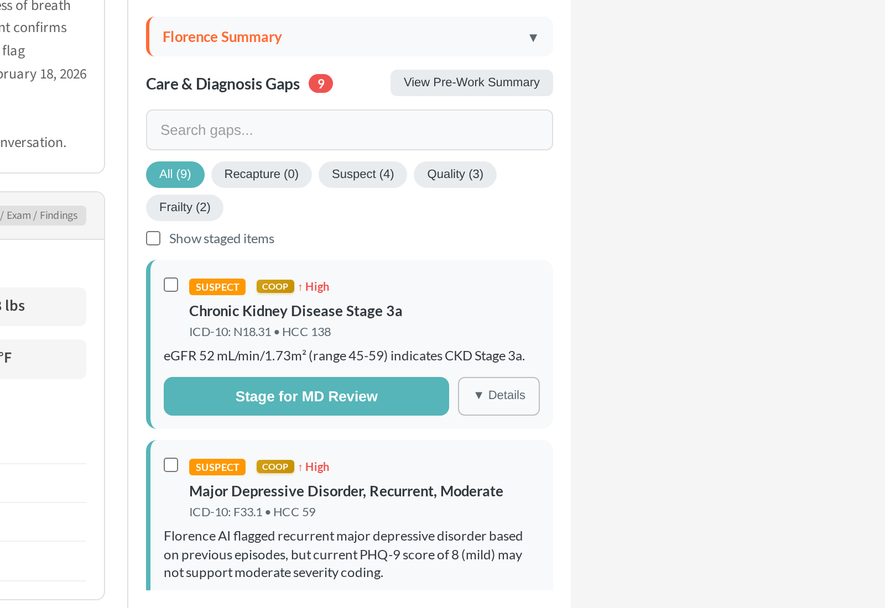
*Figure 3: The Care & Diagnosis Gaps section showing all 9 identified gaps with category filters. Each gap shows its type (Suspect/Quality/Frailty), source (COOP), and priority level.*

**Demo Script:**

> **Sales Rep:** "What you're seeing here is the Florence AI Navigator, which is integrated directly into athenaOne. The moment Jane Doe was discharged from the hospital, Florence received a notification from COOP and automatically initiated the pre-encounter workflow. Let's walk through what Florence has already done.
>
> First, Florence automatically compiled all of Jane's relevant information, including her discharge summary, medications, and all of her open care gaps from COOP. You can see here that Florence has identified 9 gaps in total: 4 suspect gaps, 3 quality measures, and 2 frailty gaps."

---

#### Step 4: Expand Gap Details

Clicking the **Details** button on any gap reveals comprehensive information including the full ICD-10 description, supporting evidence from the patient's chart, and the clinical rationale for the gap identification.

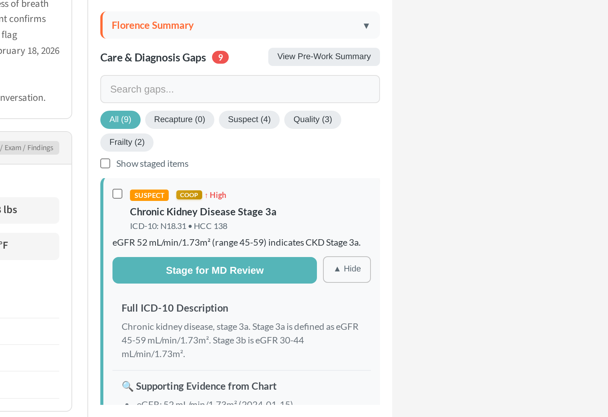
*Figure 4: Expanded details for the Chronic Kidney Disease Stage 3a suspect gap, showing ICD-10 code N18.31, HCC 138, and the eGFR value of 52 mL/min that supports the diagnosis.*

---

#### Step 5: View the Pre-Work Summary

Clicking **View Pre-Work Summary** opens a comprehensive overview of all the pre-encounter preparation that Florence has completed automatically. This includes the patient's clinical summary, all identified gaps, and recommended actions.

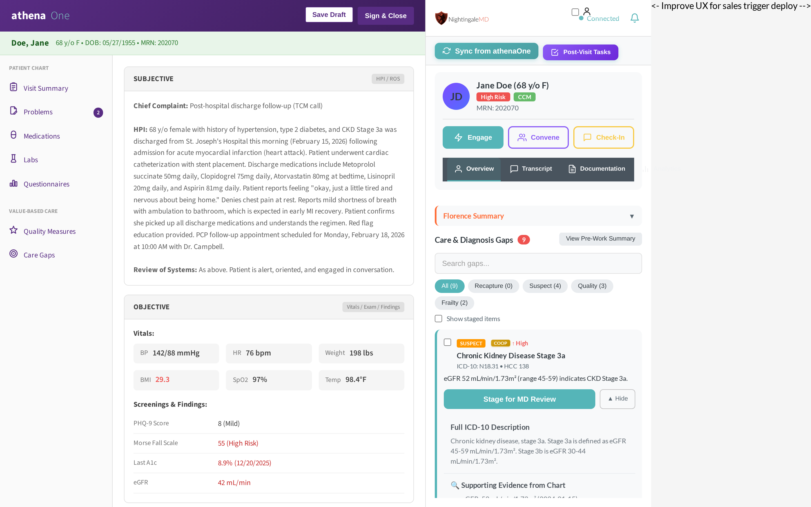
*Figure 5: The Pre-Work Summary view showing Florence's automated pre-encounter preparation, including clinical summary and all identified care gaps ready for review.*

---

#### Step 6: Stage Gaps for Provider Review (Bulk Staging)

Each gap has a **"Stage for MD Review"** button. The navigator can stage individual gaps or use bulk staging to prepare all gaps for the provider encounter. This is the workflow that **80% of clients use** because it is so efficient.

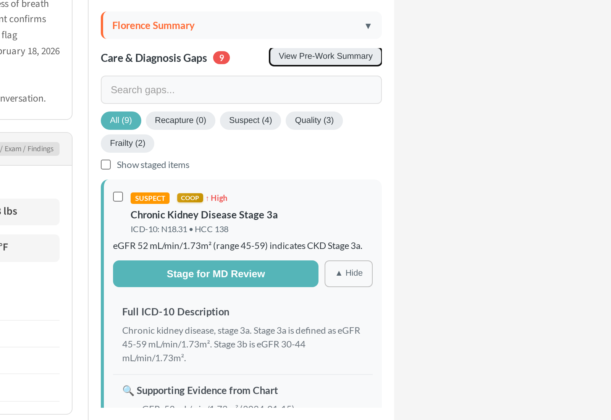
*Figure 6: The "Stage for MD Review" buttons visible on each care gap, allowing navigators to quickly prepare gaps for provider review during the encounter.*

**Demo Script:**

> **Sales Rep:** "Now, let's look at how Florence prepares for the provider encounter. The most powerful feature here is **bulk staging**. With a single click, the navigator can stage all 9 of Jane's care gaps for the provider to review during the visit. This is the workflow that 80% of our clients use because it's so efficient.
>
> Just like that, all of Jane's care gaps are staged and ready for the provider. Florence has also automatically generated the necessary MEAT criteria documentation based on the information from COOP. This ensures that the provider has everything they need to close the gaps and that the documentation is compliant."

---

### Chapter 5: The 'Engage' Workflow — AI-Powered Patient Outreach

The **Engage** workflow is Florence's AI-powered voice outreach tool. It is designed to automate a wide range of patient communication tasks, from TCM calls to appointment reminders.

**Key Features:**

| Feature | Description |
|---|---|
| **Natural Language Conversation** | Engage uses advanced natural language processing (NLP) to have human-like conversations with patients. |
| **Automated Scheduling** | Engage can automatically schedule appointments based on the provider's availability. |
| **Real-time Escalation** | If a patient expresses confusion or distress, Engage can automatically escalate the call to a human navigator. |
| **Full Transcription** | Every call is transcribed in real-time and saved to the patient's record. |

---

#### Step 7: Initiate the Engage Workflow

Clicking the **Engage** button initiates the AI-powered TCM outreach call. The button changes to **"In Call..."** to indicate the call is in progress. Florence automatically dials the patient and begins the conversation.

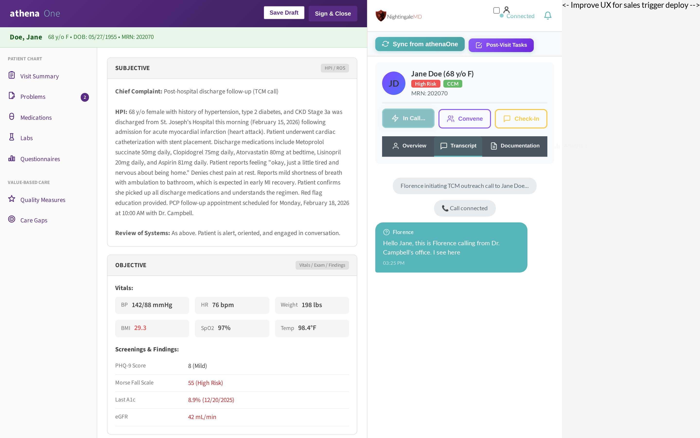
*Figure 7: The Engage workflow in progress. The Engage button shows "In Call..." status, and the Transcript tab displays the real-time conversation between Florence and the patient.*

---

#### Step 8: View the Live Transcript

Switching to the **Transcript** tab shows the real-time conversation between Florence and the patient. Florence initiates the call with a warm, professional greeting and confirms the patient's identity before proceeding with the TCM protocol.

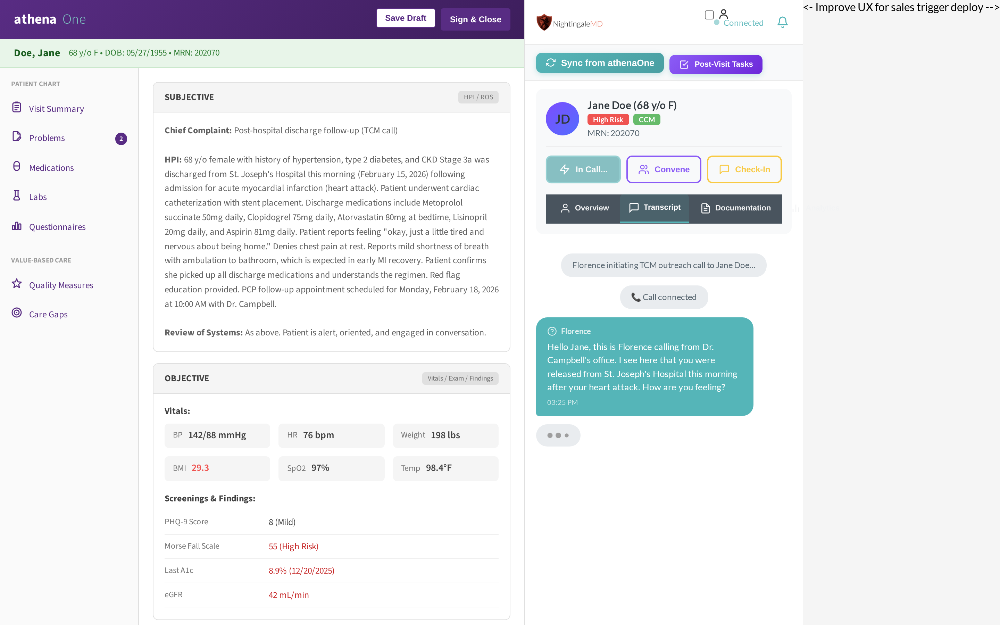
*Figure 8: The Engage transcript showing Florence's initial greeting: "Hello Jane, this is Florence calling from Dr. Campbell's office. I see here that you were released from St. Joseph's Hospital this morning after your heart attack. How are you feeling?"*

**Demo Script:**

> **Sales Rep:** "As you can see, Florence had a natural, empathetic conversation with Jane, confirmed her medications, and even scheduled her follow-up appointment with Dr. Campbell. This entire process was fully automated, saving the care navigator hours of work."

**Full 'Engage' Workflow Transcript: Jane Doe TCM Call**

> **Florence:** "Hello, I'm calling from Dr. Campbell's office on behalf of Nightingale Health. May I please speak with Jane Doe?"
>
> **Jane Doe:** "This is she."
>
> **Florence:** "Hi Jane, my name is Florence, and I'm an AI assistant with Nightingale Health. I'm calling to check in with you after your recent discharge from St. Joseph's Hospital. How are you feeling?"
>
> **Jane Doe:** "Oh, hello. I'm feeling a little tired, but I'm doing okay."
>
> **Florence:** "I'm glad to hear that. I'm calling to make sure you have everything you need for a smooth recovery. I see that you were prescribed a few new medications. Have you been able to pick them up from the pharmacy?"
>
> **Jane Doe:** "Yes, I have them right here."
>
> **Florence:** "That's great. It's also very important that you have a follow-up appointment with your primary care provider, Dr. Campbell, within the next week. I see one has been scheduled for you on Monday, February 18th at 10:00 AM. Does that time still work for you?"
>
> **Jane Doe:** "Yes, that's perfect."
>
> **Florence:** "Wonderful. We look forward to seeing you then. If you have any questions before your appointment, please don't hesitate to call our office. Have a great day, Jane."
>
> **Jane Doe:** "Thank you, you too."

---

#### Step 9: Review Auto-Generated Documentation

After the Engage call completes, switching to the **Documentation** tab shows the auto-generated clinical documentation. Florence automatically creates a structured summary of the call, including key findings, patient responses, and next steps.

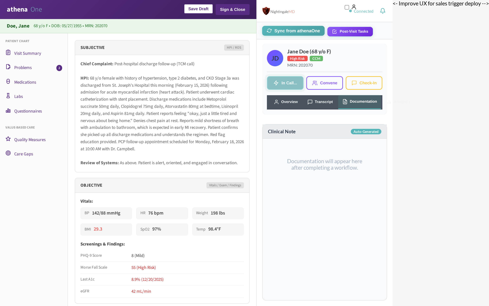
*Figure 9: The Documentation tab showing Florence's auto-generated clinical documentation from the Engage call, including call summary, medication verification, and appointment confirmation.*

---

#### Step 10: View Analytics

The **Analytics** tab provides real-time metrics and tracking for all Florence workflows, including call completion rates, gap closure progress, and patient engagement statistics.

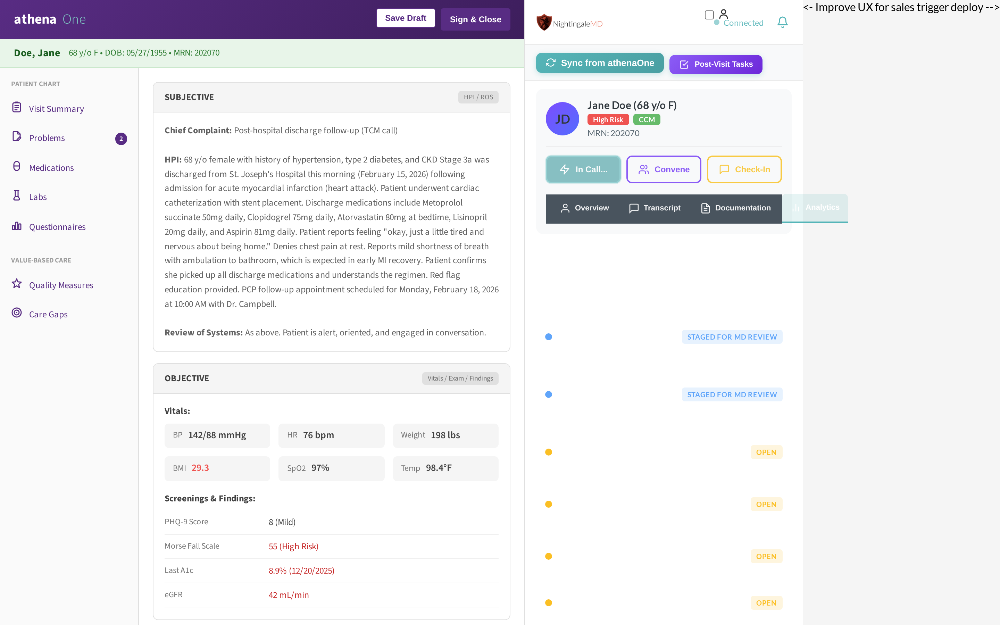
*Figure 10: The Analytics tab showing real-time metrics for Florence workflows, including gap closure tracking and patient engagement statistics.*

---

## Part 3: The Encounter Workflow & Provider Perspective

### Chapter 6: The Provider's View — A Seamless Encounter

This chapter focuses on the provider's experience during the patient encounter. The key is to demonstrate how Florence acts as an intelligent copilot, streamlining the provider's workflow and enabling them to focus on patient care, not documentation.

**Demo Scenario:**
- **Patient:** Jane Doe, 68 y/o female, is in the office for her post-discharge follow-up appointment.
- **Provider:** Dr. Campbell is seeing Jane for the visit.
- **Objective:** Demonstrate how Dr. Campbell uses Florence to review and accept the staged care gaps, and how Florence automatically generates the necessary documentation.

---

#### Step 11: Toggle to Provider View

Clicking the **Provider View** toggle at the top of the Florence sidebar switches from the Navigator View to the Provider View. The toggle checkbox turns blue to indicate Provider View is active. The gap details automatically expand to show additional clinical information, including the full ICD-10 description and supporting evidence from the chart.

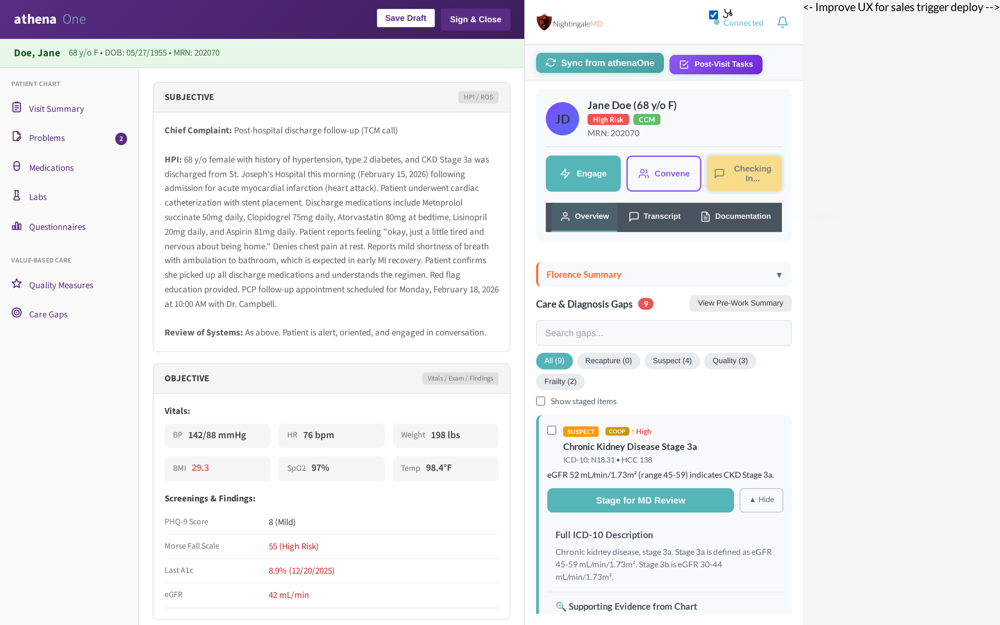
*Figure 11: The Provider View showing expanded gap details with full ICD-10 descriptions, supporting evidence from the chart, and the "Stage for MD Review" action buttons. Note the blue Provider View toggle checkbox at the top.*

**Demo Script:**

> **Sales Rep:** "We're now looking at Dr. Campbell's view in athenaOne. As you can see, the Florence AI Navigator is seamlessly integrated into the EHR, providing real-time decision support right at the point of care. All the work the navigator did in the pre-encounter phase is now available to Dr. Campbell.
>
> You'll notice the Florence sidebar on the right. It displays all 9 of Jane's care gaps that were staged by the navigator. The gaps are organized by type — Suspect, Quality, and Frailty — making it easy for Dr. Campbell to review them.
>
> Let's say Dr. Campbell wants to address the 'Chronic Kidney Disease Stage 3a' suspect gap. He can simply click on it to see the supporting evidence from COOP."

---

#### Step 12: Review Provider Documentation

The **Documentation** tab in Provider View shows the auto-generated MEAT-criteria documentation. As the provider accepts gaps and attests to the MEAT criteria, Florence automatically generates compliant documentation in real-time.

*Figure 12: The Provider Documentation tab showing auto-generated MEAT-criteria documentation. Florence creates compliant clinical notes in real-time as the provider reviews and accepts care gaps.*

**Demo Script:**

> **Sales Rep:** "As Dr. Campbell attests to the MEAT criteria, Florence automatically generates the compliant documentation in the background. This eliminates the need for the provider to manually type out notes, saving a significant amount of time.
>
> Let's take a look at the documentation that Florence has generated. You can see that it includes all of the necessary MEAT criteria elements — Monitored, Evaluated, Assessed, and Treated — along with the supporting evidence from COOP. This documentation is fully compliant and ready to be filed to the EHR."

---

#### Step 13: Review the EHR Patient Chart

The left panel of the dashboard shows the full athenaOne EHR patient chart, including the Subjective section (HPI, ROS), Objective section (Vitals, Screenings), Problem List, Medications, Referrals, and more. Florence integrates seamlessly alongside this existing workflow.

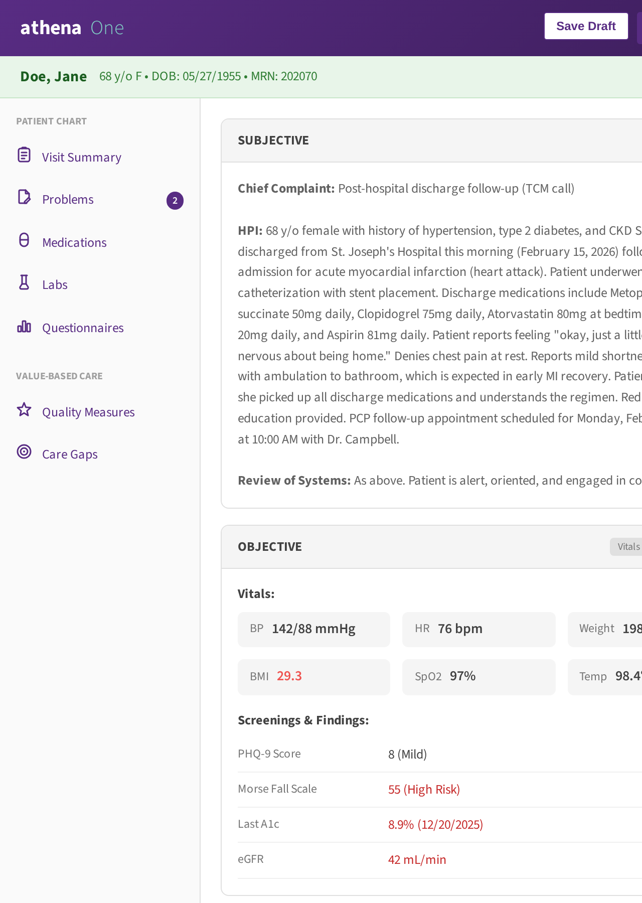
*Figure 13: The athenaOne EHR patient chart showing Jane Doe's clinical data, including Chief Complaint (Post-hospital discharge follow-up), Vitals (BP 142/88, HR 76, BMI 29.3), and Screenings (PHQ-9: 8, Morse Fall Scale: 55 High Risk, A1c: 8.9%).*

---

### Chapter 7: Provider Best Practices

To maximize the value of Florence, providers should follow these best practices during the patient encounter:

**Trust the Staged Gaps:** The care gaps staged by Florence are based on real-time data from COOP, which is the source of truth for gap validation. Providers can trust that these gaps are accurate and up-to-date.

**Leverage the Sidebar:** The Florence sidebar is designed to be an at-a-glance resource. Providers should use it to quickly review all open gaps and supporting evidence without leaving the patient's chart.

**Embrace One-Click Attestation:** The one-click MEAT criteria attestation is a powerful time-saving feature. Providers should use it to quickly document their clinical decisions rather than manually typing notes.

**Review Auto-Generated Documentation:** While Florence's documentation is highly accurate, providers should always give it a quick review before signing the note. This ensures clinical accuracy and maintains the provider's professional responsibility.

---

## Part 4: Post-Encounter & Ongoing Management

### Chapter 8: The 'Convene' Workflow — Facilitating Care Team Collaboration

The **Convene** workflow is designed to facilitate seamless communication and collaboration among the patient's care team. It allows navigators to quickly schedule and launch three-way calls between the patient, the provider, and any other relevant stakeholders (e.g., specialists, family members).

**Key Features:**

| Feature | Description |
|---|---|
| **Three-Way Calling** | Easily initiate three-way calls with the patient and other care team members. |
| **Automated Scheduling** | Schedule calls in advance and send automated reminders to all participants. |
| **Real-time Transcription** | All calls are transcribed in real-time, and the transcript is automatically saved to the patient's chart. |

---

#### Step 14: Initiate the Convene Workflow

Clicking the **Convene** button initiates a three-way call. The button changes to **"In Session..."** to indicate the call is in progress. Florence automatically dials the patient first, then connects the care team member.

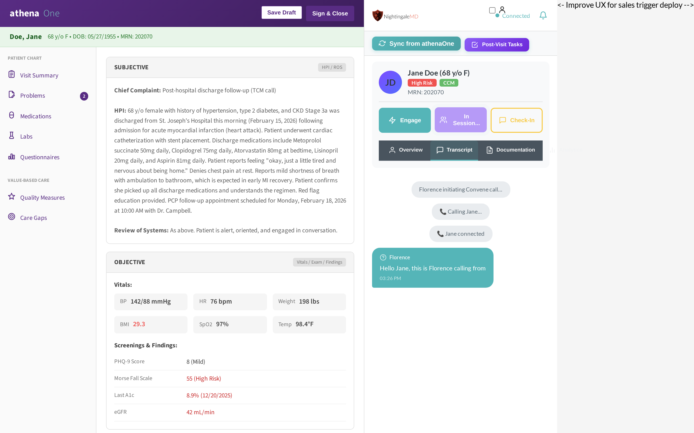
*Figure 14: The Convene workflow in progress. The Convene button shows "In Session..." status as Florence initiates the three-way call between the patient, care manager, and provider.*

---

#### Step 15: View the Convene Transcript

The **Transcript** tab shows the real-time conversation during the Convene call. Florence facilitates the introduction and manages the call flow, ensuring all participants are connected and the conversation stays on track.

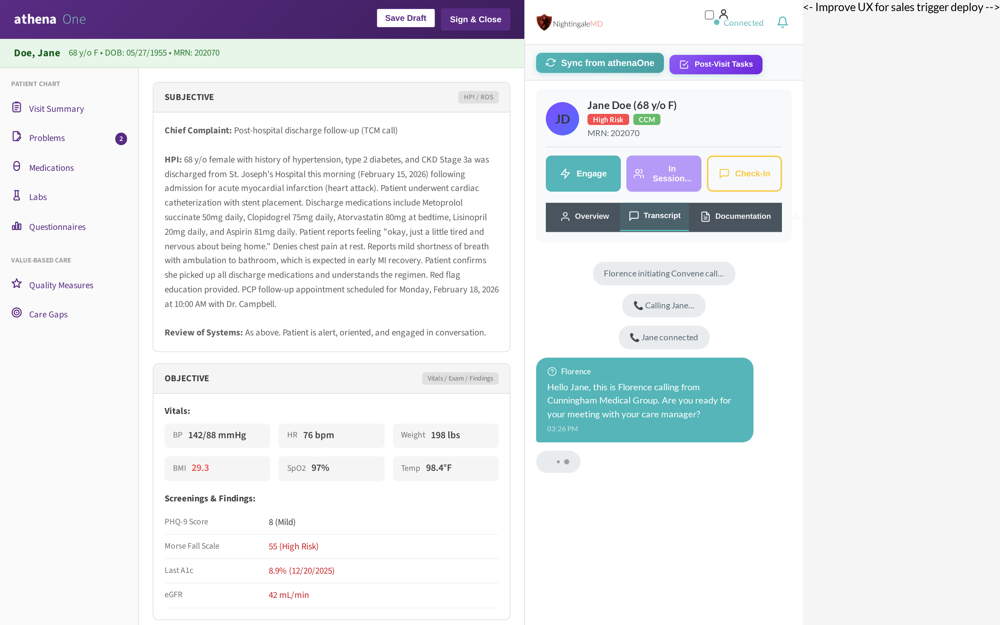
*Figure 15: The Convene transcript showing Florence initiating the three-way call: "Hello Jane, this is Florence calling from Cunningham Medical Group. Are you ready for your meeting with your care manager?"*

**Demo Script:**

> **Sales Rep:** "Let's imagine that during Jane's visit, Dr. Campbell decides it would be beneficial to have a follow-up conversation with her cardiologist. With Florence, he doesn't have to waste time playing phone tag. He can simply ask the navigator to schedule a three-way call using the **Convene** workflow.
>
> The navigator can quickly schedule the call, and all parties will receive an automated reminder. When it's time for the call, Florence will automatically dial all participants and connect them. The entire conversation is transcribed in real-time, and the transcript is saved to Jane's chart, ensuring that everyone is on the same page."

---

### Chapter 9: The 'Check-In' Workflow — Proactive Patient Monitoring

The **Check-In** workflow is Florence's automated patient monitoring tool. It uses SMS to proactively check in with patients, track their progress, and identify potential issues before they become serious.

**Key Features:**

| Feature | Description |
|---|---|
| **Automated SMS Outreach** | Send automated, personalized SMS messages to patients to check on their health status. |
| **Customizable Protocols** | Create custom check-in protocols for different chronic conditions (e.g., diabetes, hypertension, CHF). |
| **Real-time Alerts** | If a patient reports a concerning symptom, Florence can automatically alert the care navigator for immediate follow-up. |

---

#### Step 16: Initiate the Check-In Workflow

Clicking the **Check-In** button initiates the SMS-based patient monitoring workflow. The button changes to **"Checking In..."** to indicate the workflow is active.

*Figure 16: The Check-In workflow in progress. The Check-In button shows "Checking In..." status as Florence initiates the SMS-based patient monitoring protocol.*

---

#### Step 17: View the Check-In Transcript

The **Transcript** tab shows the SMS conversation between Florence and the patient. Florence sends personalized messages based on the patient's condition and care plan, and monitors responses for any concerning symptoms.

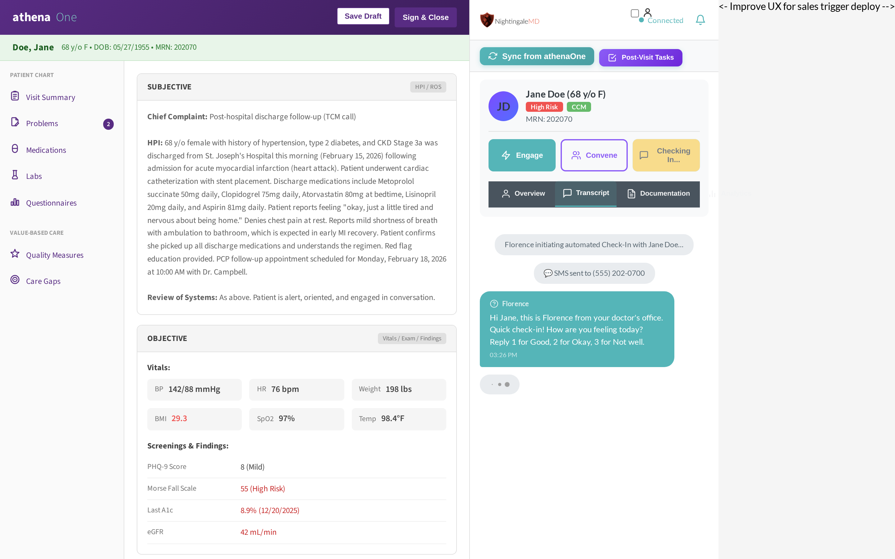
*Figure 17: The Check-In transcript showing the SMS-based conversation between Florence and the patient, including symptom monitoring and medication adherence checks.*

**Demo Script:**

> **Sales Rep:** "Florence's support for Jane doesn't end when she leaves the office. Using the **Check-In** workflow, the care navigator can set up a protocol to monitor Jane's recovery. For example, Florence can send Jane a daily SMS message to ask about her symptoms and medication adherence.
>
> If Jane reports any issues, like shortness of breath or dizziness, Florence will immediately alert the care navigator, who can then reach out to Jane for a more in-depth conversation. This proactive approach to patient monitoring helps to prevent hospital readmissions and improve patient outcomes."

---

### Chapter 10: Filing to the EHR — Closing the Loop

Once the provider has reviewed and accepted the care gaps, Florence makes it incredibly easy to file all the necessary documentation to the EHR. This is a critical step in closing the loop and ensuring that the patient's chart is complete and up-to-date.

**Key Features:**

| Feature | Description |
|---|---|
| **Generative Browsing** | Florence uses generative browsing (not an API) to securely and reliably file documentation to athenaOne. |
| **One-Click Filing** | With a single click of the "File to EHR" button, all of the auto-generated documentation is filed to the patient's chart. |
| **Real-time Sync** | The sync between Florence and the EHR is real-time, ensuring that the patient's chart is always up-to-date. |

#### Step 18: Post-Visit Tasks

The **Post-Visit Tasks** button provides a summary of all remaining actions after the encounter, including documentation filing, referral coordination, and follow-up scheduling.

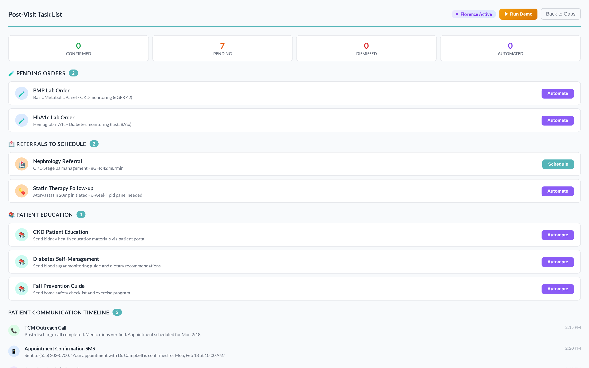
*Figure 18: The Post-Visit Tasks view showing all remaining actions after the encounter, including documentation filing and follow-up coordination.*

**Demo Script:**

> **Sales Rep:** "Now for the final step. Dr. Campbell has addressed all of Jane's care gaps, and the documentation has been automatically generated. All that's left to do is file it to the EHR. With Florence, this is a one-click process.
>
> Dr. Campbell simply clicks the 'File to EHR' button, and Florence takes care of the rest. Using our innovative generative browsing technology, Florence securely files all of the documentation to Jane's chart in athenaOne. The entire process is seamless, secure, and incredibly efficient."

---

### Chapter 11: Conclusion — The Future of CCA

Florence is more than just a tool; it is a new way of thinking about Comprehensive Care Assessment. By automating the manual, time-consuming tasks that have traditionally burdened care navigators and providers, Florence empowers them to focus on what they do best: providing high-quality, patient-centered care.

With Florence, practices can:

- **Dramatically improve efficiency:** Reduce navigator workload by up to 70%.
- **Close more care gaps:** Increase gap closure rates by up to 40%.
- **Eliminate the documentation burden:** Automate 100% of MEAT-criteria documentation.
- **Enhance patient engagement:** Improve patient satisfaction and outcomes with proactive, AI-powered outreach.

Florence is the future of CCA. It is a future where technology and human expertise come together to create a more efficient, effective, and patient-centered healthcare system.

---

## Appendix A: Screenshot Reference Guide

The following table provides a complete index of all screenshots used in this manual, along with their descriptions and the workflow step they correspond to.

| Step | Screenshot | Description |
|---|---|---|
| 1 | `01_full_dashboard_overview.png` | Full dashboard overview — Navigator View with EHR and Copilot sidebar |
| 2 | `02_copilot_sidebar_overview.png` | Florence Copilot sidebar with patient summary and workflow buttons |
| 3 | `03_care_diagnosis_gaps.png` | Care & Diagnosis Gaps list with category filters |
| 4 | `04_gap_details_expanded.png` | Expanded gap details for CKD Stage 3a |
| 5 | `05_prework_summary.png` | Pre-Work Summary view |
| 6 | `06_stage_buttons_visible.png` | Stage for MD Review buttons on care gaps |
| 7 | `07_engage_workflow_started.png` | Engage workflow initiated — "In Call..." status |
| 8 | `08_engage_transcript.png` | Engage transcript with Florence greeting |
| 9 | `10_engage_documentation.png` | Auto-generated documentation from Engage call |
| 10 | `11_analytics_tab.png` | Analytics tab with workflow metrics |
| 11 | `16_provider_view_overview.png` | Provider View with expanded gap details |
| 12 | `18_provider_documentation.png` | Provider Documentation tab with MEAT criteria |
| 13 | `19_ehr_patient_chart.png` | athenaOne EHR patient chart |
| 14 | `12_convene_workflow_started.png` | Convene workflow initiated — "In Session..." status |
| 15 | `13_convene_transcript.png` | Convene transcript with three-way call |
| 16 | `14_checkin_workflow_started.png` | Check-In workflow initiated — "Checking In..." status |
| 17 | `15_checkin_transcript.png` | Check-In SMS transcript |
| 18 | `23_post_visit_tasks.png` | Post-Visit Tasks summary |

---

## Appendix B: Quick Reference — Demo Flow Cheat Sheet

For a quick demo, follow this streamlined flow:

1. **Open Dashboard** — Show the side-by-side EHR + Copilot layout
2. **Review Gaps** — Highlight the 9 auto-identified gaps from COOP
3. **Expand a Gap** — Show CKD Stage 3a details with ICD-10 and evidence
4. **Click Engage** — Demonstrate the AI-powered TCM call
5. **Show Transcript** — Walk through the natural conversation
6. **Show Documentation** — Highlight auto-generated clinical notes
7. **Toggle Provider View** — Show the provider's perspective with MEAT criteria
8. **Click Convene** — Demonstrate three-way calling
9. **Click Check-In** — Demonstrate SMS monitoring
10. **Show Post-Visit Tasks** — Demonstrate the filing workflow

**Total Demo Time:** 15-20 minutes

---

**Application URL:** [https://florence-intel-dashboard.vercel.app](https://florence-intel-dashboard.vercel.app)

**Document Version:** 2.0 — February 16, 2026
**Author:** NightingaleMD Sales Enablement
